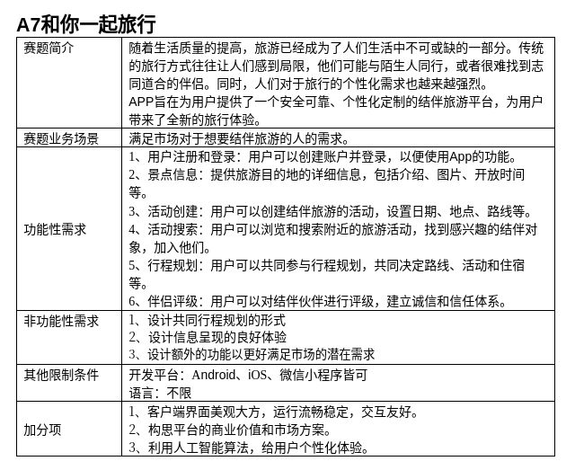

# A7 和你一起旅行



## slowly start

(还未研究容器启动rpc，私密马赛)
```bash
mv config/config-example.yaml config/config.yaml
rm -r config/config-example.yaml
docker-compose up -d
```

```bash
go build bocchi/api
go run bocchi/api
```
```bash
go build bocchi/rpc/user
go run bocchi/rpc/user
```
